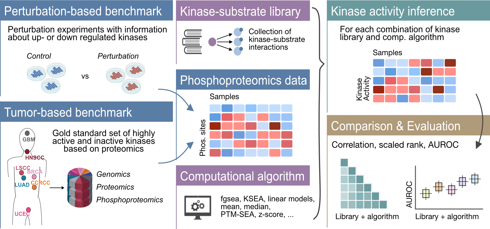

# Systematic comparison of methods for kinase activity estimation

<!-- badges: start -->
<!-- badges: end -->

## Overview
In this study, we present a flexible framework to assess different combinations of computational algorithms and kinase-substrate libraries 
for the inference of kinase activities. For the benchmark, we use a set of kinase perturbation experiments to evaluate which combination
is able to recapitulate the perturbed kinases from the phosphoproteomics data. Additionally, we propose a new benchmarking strategy based
on multi-omics tumor data.

If you want to test your own method try out our package [benchmarKIN](https://github.com/saezlab/benchmarKIN) and check out the 
[documentation](https://benchmarkin.readthedocs.io/). 

If you would like to access any of the files used in our publication, please check out our [Zenodo repository](https://zenodo.org/records/14824013).

## Kinase substrate libraries
We have included the following kinase-substrate libraries:
- PhosphoSitePlus
- PTMsigDB
- Omnipath
- Gold Standard set of GPS 6.0
- iKiP-db
- NetworKIN

Additionally have tested the combination with predicted targets including the Kinase Library and Phosformer.

## Methods
We have included the following methods for the comparison:
- fgsea
- Fisher's exact test
- KARP
- KSEA
- Kologomorov-Smirnov
- linear model - RoKAI
- Mann-Whitney-U test
- mean
- median
- multivatiate linear model - decoupler
- normalised mean
- Principal Component Analysis
- PTM-SEA
- sum
- univariate linear model - decoupler
- upper quantile
- VIPER
- z-score
- X-square test

## Citation
> Mueller-Dott, Sophia, Eric J. Jaehnig, Khoi Pham Munchic, Wen Jiang, Tomer M. Yaron-Barir, Sara R. Savage, Martin Garrido-Rodriguez, et al. 2024. “Comprehensive Evaluation of Phosphoproteomic-Based Kinase Activity Inference.” bioRxiv. [https://doi.org/10.1101/2024.06.27.601117](https://doi.org/10.1101/2024.06.27.601117).
